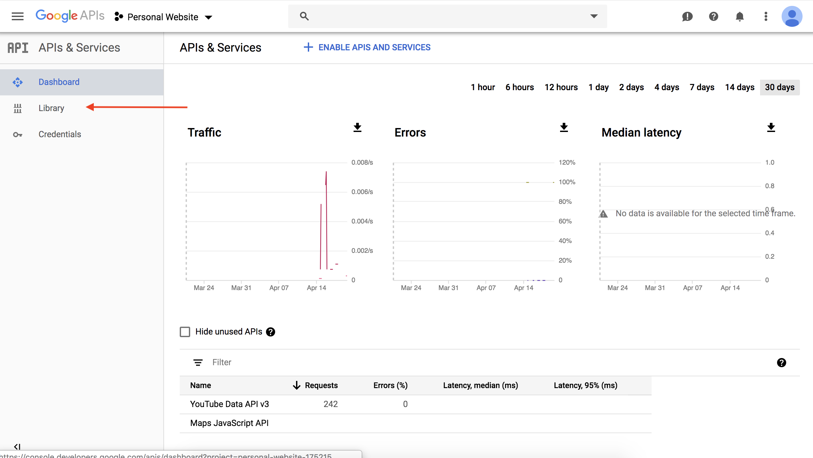
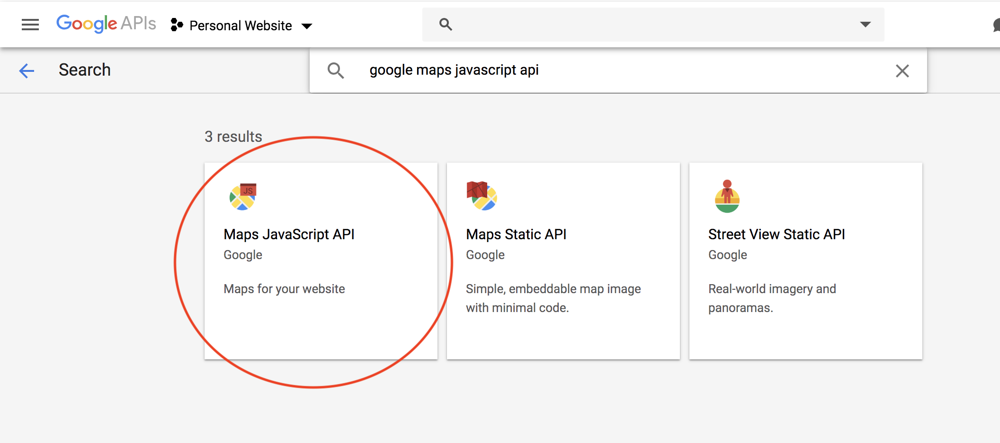

# Google Maps API Completed Demo

This repo contains the solution to ur Google Maps API Demo. We used surge to deploy this site and give it as an example, so the class knows what the end goal of our demo is.

Maps are everywhere :rainbow: We'd be lost without the maps on our phone, and apps from Uber to Snapchat wouldn't work without the capabilities of these APIs. Map APIs give us data we couldn't get otherwise like routing and time estimation, produce cool data visualizations and construct augmented reality. The best part is, it's pretty easy for us to take advantage of all their cool features too :smiley_cat:

## Overview

For this demo, we're going to be writing a react app that utilizes the Google Maps API. First, we're going to learn how to loading a map to a react project. Then, we'll center and zoom in on Dartmouth. Next, we're going to drop markers, with personalized info windows on our map. Lastly, we're going to create a shape data visualization based on our points! 

## Setup

Clone the workshop repository and `cd workshop-ws-04-23-maps`. Then run `yarn install` (this may take a second). We need to install all the dependencies from the package.json file. Then run `yarn start` to make sure everything's looking good :sunglasses: 

:rocket: We're using a different "starter-pack." This one is called **create react app** and it's used by front end developers to quickly create a complete react development environemnt. Though our starter pack is great, this one has a few more things we're going to need.

Our Yarn install includes something called **google maps react**. This is a JavaScript library that uses the Google Maps API and it makes it compatable with react projects. 

Since we're using the Google Maps JavaScript API, we need to fetch an API key, just like we did for the Youtube API in Short Assignment 4. To do this you should head to http://console.developers.google.com

1. Select **Library** on the lefthand, invisable menu and you should see a screen like this:



2. Next, search for "Google Maps JavaScript API" it should look like this and then click on it:



3. Once you've clicked on the "Google Maps JavaScript API" click enable to enable that API


4. You'll be taken to a screen that looks something like this. Because we all have google projects from SA 4, we don't need to make a new one. Click on **Credentials** and your API key should be listed! 


:warning: Copy your API key because you're going to need it soon!

## Step by Step

Now that everything's set up, we're going to start adding to our application. Throughout building you can run `yarn start` from **workshop-ws-04-23-maps** to see your changes in real time!

You should see this image! If you do you're all set to go.


### Rendering the Map Component

Time to start coding! `cd src` and open up `App.js`. This is the main component we will be working with and editing. To start, let's add your API key. Insert your copied key where it says `ENTER_YOUR_API_KEY_HERE`. This way, you can get access to everything Google Maps has to offer. If you reload here, you won't see any changes. That's okay because we haven't added a map yet! 

:exclamation: You might have noticed that linting isn't turned on! This is because we have turned off linting in our special starter pack. I know you miss it but it should be fine for this demo.

Let's start out by getting a basic Google Map to load on the screen, and then we'll start adding features. **google react maps** already has a component called Map that we'll be using to load our map. We need to import the Map component from **google react maps**. At the top of your App.js add:

```javascript
import { Map, GoogleApiWrapper } from 'google-maps-react';
```

Now we're going to render our Map component. In your render method, under the H1 tag, add:

```javascript
<Map 
    google={this.props.google}
> 
</Map>
```

google here is a prop of the Map component, 

Look at that map! :scream: You should have something that looks like this 


Feel free to play with the buttons on the top left corner. They enable you to do things like see the terrain or satelite views. Pretty cool!

Boston's cool but let's center it in Hanover! To your Map component we're going to pass it a prop called `initial center` which will be the latitude and longitude of the center of our map. The latitude and longitude of Dartmouth is: **43.7044, -72.2887**.

Right below `google={this.props.google}` add

```javascript
initialCenter={{
    lat: YOUR LATITUDE HERE,
    lng: YOUR LONGITUDE HERE
}}
```

Now your map should be centered where you wanted. Next, we're going to adjust the zoom to cover all the area you want to see. Right below `initial center={{...}}` add

```javascript
zoom={16}
```

We like the zoom set at 16, but feel free to change it. 

### Adding Markers and an InfoWindow to the Map

In this library, Markers and InfoWindows are their own components. To use them, we need to import them! Add `InfoWindow, Marker` to `import { Map, GoogleApiWrapper } from 'google-maps-react';` (the import statement you already have). Let's drop a marker!

Within your Map component, we're going to add a Marker Component, so it'll be the child of `<Map />`. Add the code bellow inbetween the Map tags.

```javascript
<Marker
    name={'This is a marker we just made yay!'}
/>
```

You should see something like the picture below. The marker will drop automatically in the center of the map, but we can change this later.


Now, let's make it clickable with an InfoWindow that'll open up and give us a description of our marker. Let's add an InfoWindow component. This will also be a child of the Map component.

After the Marker component, add 

```javascript
<InfoWindow>
</InfoWindow>
```

It's empty :scream: Don't worry we'll add some event handlers that'll make it functional!

Before we start, we need to add State to our component. Before, it didn't really have to keep track of anything, but now we need State to keep track of whether a marker is clicked.

To do this, let's add a constructor and some state. Above your `render` function, add the code:

```javascript
constructor(props) {
    super(props);
    this.state = {
        showingInfoWindow: false, //Hides or the shows the infoWindow
        activeMarker: {}, //Shows the active marker upon click
        selectedPlace: {} //Shows the infoWindow to the selected place upon a marker
    }; 
} 
```

We are keeping track of three things: `showInfoWindow` which is a boolean that will tell the component whether to render the infowindow or not, depending on if the marker is clicked, `activeMarker` which will keep track of the markers that are currently clicked and `selectedPlace` which will show the infowindow of the selected marker. 

Try clicking on the marker. It doesn't do anything! That's because we need to add event handlers to actually modify its state. We're going to need two event handlers, one to open the InfoWindow window when you click the marker, and one to close the InfoWindow when you click the close button.

Underneath your constructor, add the event handler:

```javascript
onMarkerClick = (props, marker, e) =>
  this.setState({
    selectedPlace: props,
    activeMarker: marker,
    showingInfoWindow: true
});
```

When the marker is clicked, this will change the state and activate the marker: the info window will pop up! You also need to add an onClick handler your Marker component. Add the code below to your Marker tag.

```javascript
onClick={this.onMarkerClick}
```

We also need to define the onMarkerClick function for it to work *duh*. Insert this function below the constructor:

```javascript
onMarkerClick = (props, marker, e) =>
  this.setState({
    selectedPlace: props,
    activeMarker: marker,
    showingInfoWindow: true
});
```

Uh oh! It still doesn't do anything when you click it. That's because we don't have an info window. Let's fix that. First let's add some content to our InfoWindow component. We need to connect our InfoWindow to our marker. In order to do this, we pass our InfoWindow component the following:

```javascript
marker={this.state.activeMarker}
visible={this.state.showingInfoWindow}
```

This gives the InfoWindow component the Active Marker's name and tells it to show up!

In between the InfoWindow tags, add the code below to give it some content.

```javascript
<div>
    <h2>{this.state.selectedPlace.name}</h2>
</div>
```

YAY! Let's close it and go home, right? Wait, what did the marker say again? Oh no. We can't reopen the textbox! But, why? Why isn't this working? Well, thank you for asking, young grasshopper. It's because we don't have an on close handler. In the InfoWindow tag, add the following code under the marker and visible variables:

```javascript
onClose={this.onClose}
```

Again, we need to actually define the onClose function below the constructor to make this work:

```javascript
onClose = props => {
    if (this.state.showingInfoWindow) {
        this.setState({
        showingInfoWindow: false,
        activeMarker: null
        });
    }
};
```

Woohoo! :dancer: Now you should see something like this and be able to open and close it as many times as you want! Sick


### Adding Data Vizzzz 

Now we have a map with a marker. Heck yah. Let's add a little spicy data to make our map interesting. Before we add a shape, whose edges are the data points we're about to define, we need to get that set of data. This is the one we used, but feel free to go back on the website above, and chose your own points! Just remember, the first and the last point have to be the same, so the shape comes full circle.

At the top of your `render` function, add: 


```javascript
const triangleCoords = [
    {lat: 43.7046, lng: -72.2943}, //thayer
    {lat: 43.7034, lng: -72.2886}, //green
    {lat: 43.7091, lng: -72.2839}, //LSC
    {lat: 43.7046, lng: -72.2943} //thayer
];
```

Can you see guess points we chose? It's pretty hard so let's actually map them.

In this library, `Polygons`, what we'll use to construct our shapes, is another Component. You know the drill, we have to import it. Add `Polygons` to the list of components you've already imported. 

Now let's add our Polygon component. It'll be another child of Map, so make sure to put it inbetween the Map tags. 

Under InfoWindow add the code: 

```javascript
<Polygon
    paths={triangleCoords}
    strokeColor="#0000FF"
    strokeOpacity={0.8}
    strokeWeight={2}
    fillColor="#0000FF"
    fillOpacity={0.35} 
/>
```
WOAH! What is all that stuff? `paths` lets the polygon know which points we want to trace. The rest of the props will style our component. Feel free to switch these up however you want! 

Look at your page! You should see something like this:


You just made your own React App that includes the Google Maps API with some cool customization and data visualization. 


### Extra Credit

Can make something more complex than a triangle? Let's add some more points into our data set. Add some more points into `triangleCords`.

:alert: Where do you add the code below within the data set? This is a little tricky, but try it out! You may get something very funky. 

```javascript
{lat: 43.7074, lng: -72.2911}, //choates
{lat: 43.7066, lng: -72.2968}, //ledyard
{lat: 43.7030, lng: -72.2841}, //gym
```

Feel free to find the latitutde and longitude of somewhere else and put that in if you want! This website makes it easy to find those values https://www.latlong.net/ Then, you can create your own shape within the new location you chose. 

## Summary 

**What your site has:**

* [ ] A map, that is centered around a certain point and zoomed in to a level you like
* [ ] At least one marker of a point of your choosing, with a custom info window
* [ ] Event handlers than enable you to click on your marker and see you infor window
* [ ] A shape whose points are those you selected in the list above

**Extra Credit** Your graph centers around somewhere that isn't Dartmouth and/or style your map to make it your own :sunglasses:

**What you learned:**

* [ ] What an API is and what map APIs are capable of
* [ ] The pros and cons of the different map API options (Leaflet, Mapbox, Google Maps)
* [ ] Adding a map to your React app and customizing the location, zoom and pins
* [ ] Leveraging a data set to produce cool data visualtions with the Google Maps API
* [ ] Styling your map to be your own!

## Reflection

:bulb: Remember to submit these on canvas!

* [ ] Explain the basic idea of how these map APIs work.
* [ ] Can you think of any instances where you would use a map API in a web or mobile app? For one of those examples, which API (Leaflet, Mapbox, Google Maps) would you choose and why?

## Resources

* https://developers.google.com/maps/documentation/
* https://trends.builtwith.com/websitelist/Google-Maps-API
* https://www.datanyze.com/market-share/mapping-and-gis/United%20States/google-maps-api-market-share
* https://jungleworks.com/google-vs-mapbox/
* https://leafletjs.com/
* https://www.mapbox.com/
* https://www.fullstackreact.com/articles/how-to-write-a-google-maps-react-component/#the-map-container-component

## Link to our Power Point

https://docs.google.com/presentation/d/1kFYbvW4CdcYt7os8FXeKOqM1Vs_y9IbsqyPxfru8Y6E/edit?usp=sharing
